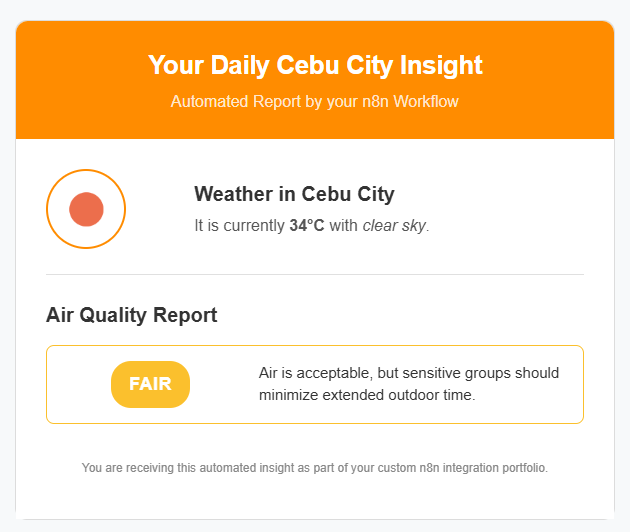
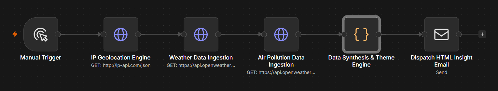

# Adaptive Environmental Insight Engine (n8n)

An enterprise-grade, travel-ready automation pipeline built using **n8n** that completely orchestrates data ingestion, data synthesis, and localized notification delivery. 

Instead of relying on hardcoded regions, this application dynamically references network tracking coordinates on execution to serve custom visual assets and critical health telemetry directly to a user's inbox.

---

## 📱 Live Preview & Interface

When the workflow triggers, it dynamically queries the network location, checks environmental health data, selects a matching color theme, and dispatches a responsive HTML newsletter tailored to your current location:

  

---

## ⚙️ Core Architecture & Pipeline

The system is built as a sequential and parallel multi-threaded data pipeline:

1. **IP Geolocation Engine:** Pings network lookup tables to isolate real-time latitude, longitude, and city structures.
2. **Asynchronous Ingestion Forks:** Feeds spatial variables simultaneously into independent REST endpoints to fetch raw atmospheric state matrices and Air Quality Index classifications.
3. **Synthesis Engine:** Uses a centralized JavaScript node to map data structures, evaluate logic thresholds, and assign dynamic HEX color themes.
4. **Transport Layer:** Fires secure SMTP protocols to deliver fully inline-styled responsive HTML layouts.

  

---

## 🚀 Technical Highlights
* **Dynamic Geolocation Tracking:** Automatically adapts reporting parameters when traveling across regional zones without manual code modifications.
* **Custom JS Transformation:** Normalizes messy, independent API arrays into a singular, optimized data payload using custom JavaScript objects.
* **Reactive HTML/CSS Engine:** Features a structural email layout where header styling and warning tags shift colors reactively to mirror current weather severity levels.

## 🛠️ Built With
* **n8n Architecture** - Advanced Backend Workflow Orchestration
* **JavaScript (ES6)** - Operational Logic & Data Synthesis Engine
* **REST APIs** - OpenWeather (Current Conditions & Air Pollution Matrix), IP-API (Spatial Geo-Tracking)
* **HTML5 / CSS3** - Responsive email rendering with inline stylistic overrides
* **Google SMTP** - Secure Application Transport Layer Protocol

---

## 📦 How To Import & Run This Project

1. Clone this repository or copy the exact string contents of `workflow.json`.
2. Open your n8n workspace dashboard.
3. Press `Ctrl + I` (or `Cmd + I`), select the file, and click **Import**.
4. Configure your node credentials for **Google SMTP** (using a secure Google App Password).
5. Add your personal **OpenWeather API Key** inside the Query Parameter blocks of both data ingestion nodes.
6. Click **Execute Workflow** to run!
